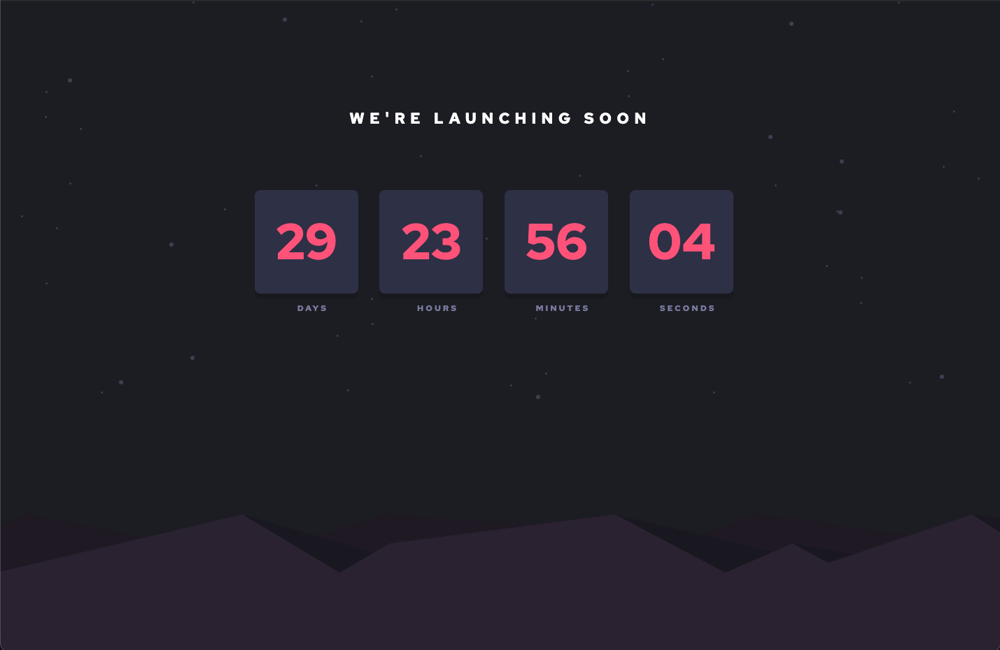

# Frontend Mentor - Launch countdown timer solution

This is a solution to the [Launch countdown timer challenge on Frontend Mentor](https://www.frontendmentor.io/challenges/launch-countdown-timer-N0XkGfyz-). Frontend Mentor challenges help you improve your coding skills by building realistic projects. 

## Table of contents

- [Overview](#overview)
  - [The challenge](#the-challenge)
  - [Screenshot](#screenshot)
  - [Links](#links)
- [My process](#my-process)
  - [Built with](#built-with)
- [Author](#author)

## Overview

### The challenge

Users should be able to:

- See hover states for all interactive elements on the page
- See a live countdown timer that ticks down every second (start the count at 14 days)
- **Bonus**: When a number changes, make the card flip from the middle

### Screenshot

### Links

- Solution URL: [Frontend Mentor Solution](https://www.frontendmentor.io/solutions/reactjs-tailwind-css-lhu5U83Dl)
- Live Site URL: [Vercel](https://countdown-silk.vercel.app/)

## My process

### Built with

- Tailwind CSS
- [React](https://reactjs.org/) - JS library

## Author

- Website - [Arynn Boniface](https://arynnboniface.com)
- Frontend Mentor - [@yourusername](https://www.frontendmentor.io/profile/yourusername)
